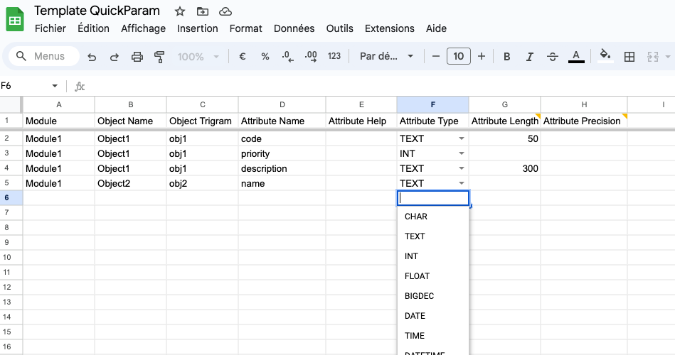
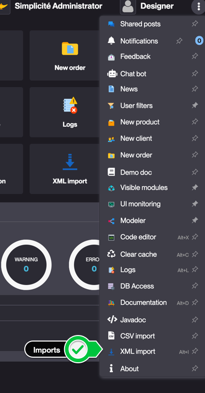

<!--
 ___ _            _ _    _ _    __
/ __(_)_ __  _ __| (_)__(_) |_ /_/
\__ \ | '  \| '_ \ | / _| |  _/ -_)
|___/_|_|_|_| .__/_|_\__|_|\__\___|
            |_| 
-->

* * *

`SimAdapters` 
===============================

Module containing some adapters to import data models

1- QuickParamAdapter & QuickListAdapter
---------------------

This is an adapter for quickly configuring apps with Simplicité. The basic steps are:
1. Create a module in Simplicité, so you can get started with a group, scope, etc (cf [tutorial](https://docs.simplicite.io/lesson/tutorial/configuration/module))
1. get the template as:
    - a Google Sheet template (you must be connected with a google account) : [Google Drive](https://docs.google.com/spreadsheets/d/1d6G3389Kz5TbOvZVWFE3EQXKz3pheNhuQwSHRHBkE3c/copy)
    - an OpenDocument file (compatible with Excel) : [Get file](./attachements/Template_QuickParam.ods)
2. in the template, fill the **QuickParamAdapter** and **QuickListAdapter** with your model

3. export those two tabs as CSV
4. in Simplicité, import this module through the App Store (AppStore > Tools > SimAdapters)
5. Go to "Shortcuts > XML Imports"

6. select **QuickParamAdapter** or **QuickListAdapter** depending on which tab you want to import
7. check import status
